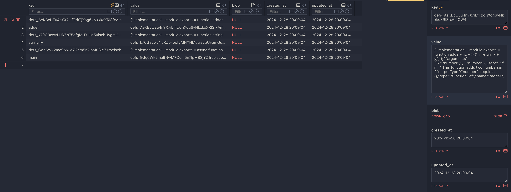

# Constrained Programming



This is an exploratory prototype, to explore the idea of code as data, and the possibility of what that may entail.

With LLMs, it is certainly better to keep functionality encapsulated, as it will help in retaining the required context for the LLM. I've had the idea for a while that what if we could somehow encapsulate programs, at a granular enough level that you could easily switch out implementations of the same interface. While this does exist in someway by switching out the functions that are called, I wanted it to be even more dynamic than that. So, this is the cumulation of that process.

Essentially, what is going on here is that there are separate functions that actually are represented within a DB as data rather than "physical" files. This affords us the ability to switch out their implementations during execution.

I see there being a natural evolution of abstractions as computers become faster and more capable:

- **imperative** programming: I have to explicitly say, store this value in this register and execute this operation on it, and store the result there.
- **declarative** programming: I want to describe the final output state which a program must figure out how to apply.
- **intentional** programming: I want to describe what I wish to achieve for this program and it is up to the computer to figure this out.

With each level, the programmer is abstracted further and further away from the actual implementation details. This is a natural progression as computers become more capable and the programmer's time becomes more valuable.

I have written a bit about this a couple of blogs posts:

- [Constrained Programming](https://nickthesick.com/blog/Constrained+Programming)
- [A scratchpad of Constrained Programming](https://nickthesick.com/blog/Constrained+Programming+Scratchpad)

## Usage

To run the code, you will need to install the dependencies with bun:

```bash
bun install
```

Then you can run the code with:

```bash
bun run example.ts
```

## What happens

The code will add 3 programs into the database that can reference each other.

- The adder program will add two numbers together
- The stringify program will convert it's input to a string
- The main program will statically reference the adder program and dynamically reference the stringify program

## How it works

The programs are stored into a database, keyed by their definition ID (a hash of their implementation). The programs are stored as JSON objects, and their implementations are transformed into a CommonJS-like module.

For example an input of:

```typescript
const asyncStringify = await createFn({
  implementation: `
    /**
     * This is a function that is resolved dynamically
     */
    export default function stringify(args){
      return JSON.stringify(args)
    }
  `,
  outputType: "string",
});
```

Would be transformed into:

```json
{
  "implementation": "module.exports = function stringify(args) {\n  return JSON.stringify(args)\n};",
  "jsdoc": "*\n   * This is a function that is resolved dynamically\n   ",
  "outputType": "string",
  "requires": {},
  "type": "functionDef",
  "name": "stringify"
}
```

Stored under the key `defs_k70G8cwvNJRZp75ofgMHYHM5uiscbUvgmGuPKWIt6ZM`. The following transformations occurred:

- The `export default` was transformed into `module.exports` statement
- The `name` of the function was automatically extracted from the implementation
- The `requires` field was automatically extracted from the implementation
- The `jsdoc` was automatically extracted from the implementation

With this function stored into the database, it can be referenced by other programs, either statically or dynamically.

### Static references

A program can reference another program statically by using the `import { program } from '${defId}'` syntax. This will add the function to the current program's scope, and allow it to be called.

Here is an example of how this would look:

```typescript
const addFn = await createFn({
  implementation: `
    import adder from '${adder}';

    /**
     * This is the addFn function
     */
    export default function addFn(){
      return adder({ x: 1, y: 2 })
    }
  `,
  outputType: "number",
});
```

```json
{
  "implementation": "module.exports = async function main() {\n  const result = adder({ x: 1, y: 2 })\n                          // import('stringify') also works too\n  const stringify = await require('defs_k70G8cwvNJRZp75ofgMHYHM5uiscbUvgmGuPKWIt6ZM')\n\n  return stringify({ result })\n};",
  "jsdoc": "*\n   * This is the main entrypoint to the program\n   ",
  "outputType": "string",
  "requires": { "adder": "defs_AeKBcUEu4nYX7iLfTzkTjXog6vNkxkoXRISfxAmOW4" },
  "type": "functionDef",
  "name": "main"
}
```

You'll notice that the `adder` it the local binding that is used to reference the `adder` program, so it is statically referenced by the `main` program.

### Dynamic references

A program can reference another program dynamically by using the `await import('${defId}')` syntax. This will add the function to the current program's scope, and allow it to be called, but only after the program has been loaded and executed which is why it is async.

Here is an example of how this would look:

```typescript
const addFn = await createFn({
  implementation: `
    /**
     * This is the async addFn function
     */
    export default async function addFn(){
      const adder = await import('${adder}');
      return adder({ x: 1, y: 2 })
    }
  `,
  outputType: "object",
});
```

Here, the `adder` program is dynamically loaded at runtime, and then called with the arguments `{ x: 1, y: 2 }`.
It may be referenced by name or by the definition ID, the name is just a convenience.

## Future work

This is a very rough prototype, and there are many things which I'd like to explore further:

- **Security**: There are many security concerns with this approach, as it is essentially running arbitrary code. This could be mitigated by running within a sandboxed environment.
- **Performance**: The current implementation is very slow, as it is essentially running a new VM for each function call. This could be mitigated by running the functions in a single VM.
- **Error handling**: The current implementation is very brittle, and will throw an error if anything goes wrong. This could be mitigated by adding better error handling.
- **Type checking**: The current implementation does not do advanced type checking, essentially it just checks that the output type matches the expected type. This could be mitigated by adding a more advanced type checking system.
- **Constraints**: The current implementation does not have any constraints on the functions, this is a whole area that could be explored further on what this could look like.
